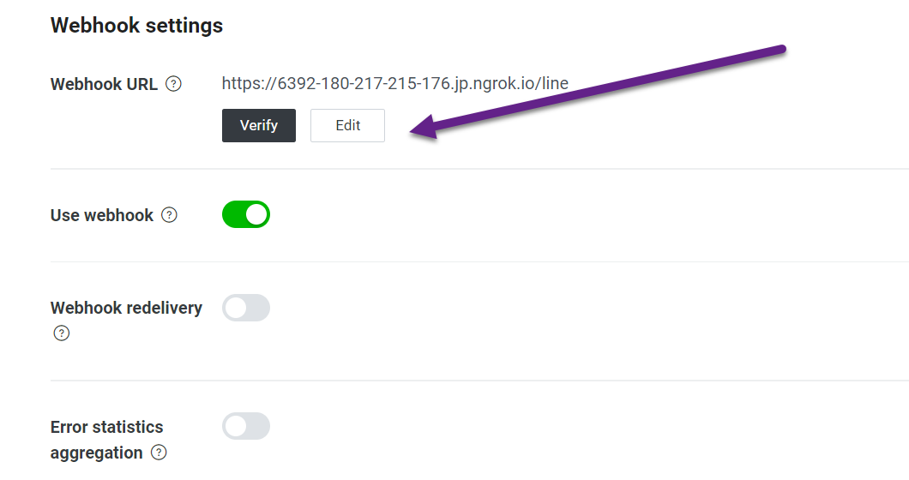
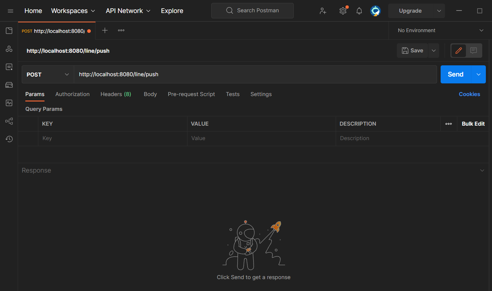

# Line & Golang & Mongodb Example

## Features
+ HTTP framework - [gin](https://github.com/gin-gonic/gin)
+ ORM - [mongo-go-driver](https://github.com/mongodb/mongo-go-driver)
+ line SDK - [line-bot-sdk-go](https://github.com/line/line-bot-sdk-go)
+ Config - [viper](https://github.com/spf13/viper)
+ CLI tools - [cobra](https://github.com/spf13/cobra)

# Before to start
+ Install [docker](https://www.docker.com/)
+ Needs to edit your userid in config/config.yaml
+ Create a line bot account with [line developers](https://developers.line.biz/zh-hant/) 
+ Enabled webhook and add the bot to your line account.

# Installation

## Create Mongodb docker
```bash
make init
```

## Run development environment
```bash
make dev
```

## Code build
```bash
make build
```

# Usage
1. After start the service,you can use [ngrok](https://ngrok.com/) to create a temporary link to use 
   webhook in line developers.
   
2. When verified succeed,you can use [postman](https://www.postman.com/) to use APIs from below.
   

## API Usage
+ /line 
  + Method:POST
  + When user type message to line bot,this api will be triggerred and stored message and user info to Mongodb.
+ /line/push
  + Method:POST
  + Line bot will push messages to specific user(use USERID)
+ /users/:userid/messages
  + Method:GET
  + Param:userid
  + query string :limit
  + It will use userid to find all messages from Mongodb and return records with limited number.
